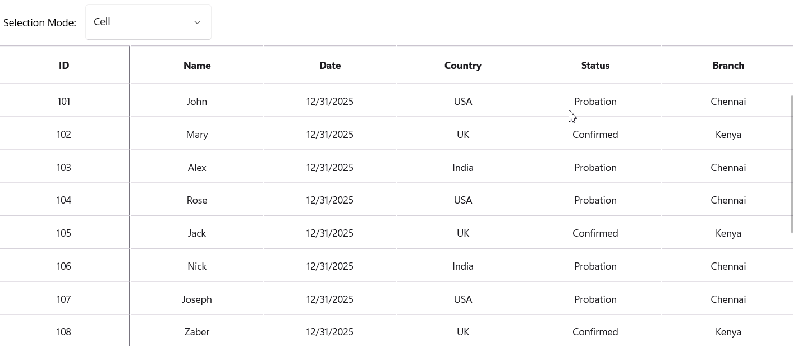

# Master Bulk Editing in .NET MAUI DataGrid
This demo shows Master Bulk Editing in .NET MAUI DataGrid.

***

## **Introduction**

Modern applications often require powerful data manipulation capabilities to handle large datasets efficiently. The **Syncfusion .NET MAUI DataGrid** provides advanced editing features that allow developers to create interactive, user-friendly, and high-performance data grids across Android, iOS, Windows, and macOS.

In this guide, we’ll explore **Master Bulk Editing in .NET MAUI DataGrid**, including **bulk editing**, **custom editors**, and **validation techniques**.

***

## **What is Bulk Column Editing?**

Bulk editing enables users to apply changes to multiple cells in a column simultaneously. For example:

*   Update the status of all selected rows.
*   Apply a discount to multiple products.
*   Change category for a batch of items.

***

## **Powerful Capabilities of Bulk Editing**

*   **Multi-Column Selection:** Select multiple columns for simultaneous edits.
*   **Custom Editors:** Use templates for specialized input fields.
*   **Validation Support:** Ensure data integrity during bulk updates.
*   **Command Integration:** Hook into `BeginEdit`, `CommitEdit`, and `EndEdit` for controlled workflows.

***

## **Bulk Edit with Popup**

```xml
<Grid RowDefinitions="Auto,*" Padding="16" Spacing="12">

    <!-- Title shows which column is being edited -->
    <Label Grid.Row="0"
           Text="{Binding TargetMappingName, StringFormat='Bulk edit: {0}'}"
           FontAttributes="Bold"
           FontSize="18"
           Margin="0,0,0,8" />

    <!-- DataGrid with multiple selection -->
    <sfgrid:SfDataGrid Grid.Row="1"
                       x:Name="dataGrid"
                       ItemsSource="{Binding Orders}"
                       SelectionMode="Multiple"
                       AllowEditing="True" />   
    <sfPopupLayout x:Name="bulkEditPopup"
               IsOpen="{Binding IsBulkPopupOpen}"
               PopupViewHeight="200"
               PopupViewWidth="300"
               HeaderTitle="Bulk Edit"
               ShowCloseButton="True">
    <VerticalStackLayout Padding="12" Spacing="8">
        <Label Text="{Binding TargetMappingName}" FontAttributes="Bold" />

        <!-- Entry for text-based columns -->
        <Entry Placeholder="Enter value"
               IsVisible="{Binding IsStatusEditing, Converter={StaticResource BoolInverseConverter}}"
               Text="{Binding BulkEditValue}" />

        <!-- Picker for Status column -->
        <Picker ItemsSource="{Binding StatusOptions}"
                IsVisible="{Binding IsStatusEditing}"
                SelectedItem="{Binding SelectedStatus}" />

        <!-- Action buttons -->
        <HorizontalStackLayout Spacing="8">
            <Button Text="Apply" Command="{Binding ApplyBulkEditCommand}" />
            <Button Text="Cancel" Command="{Binding CancelBulkEditCommand}" />
        </HorizontalStackLayout>
    </VerticalStackLayout>
</sfPopupLayout>
```

***

### ✅ What This Does:

*   **HeaderTitle:** Displays "Bulk Edit".
*   **Dynamic UI:** Switches between `Entry` and `Picker` based on `IsStatusEditing`.
*   **Bindings:** Uses `BulkEditValue` for text edits and `SelectedStatus` for status updates.
*   **Commands:** `ApplyBulkEditCommand` and `CancelBulkEditCommand` handle logic in ViewModel.

***



## **Conclusion**

 Thanks for reading! In this blog, we’ve seen Master Bulk Editing in [.NET MAUI DataGrid](https://www.syncfusion.com/maui-controls/maui-datagrid). Check out our [Release Notes](https://www.syncfusion.com/products/release-history) and [What’s New pages](https://www.syncfusion.com/products/whatsnew) to see the other updates in this release and leave your feedback in the comments section below. 
 For current Syncfusion customers, the newest version of Essential Studio is available from the [license and downloads page](https://www.syncfusion.com/Account/Login?ReturnUrl=%2faccount%2fdownloads). If you are not yet a customer, you can try our 30-day free [trial](https://www.syncfusion.com/downloads) to check out these new features. 
 For questions, you can contact us through our support [forums](https://www.syncfusion.com/forums), [feedback portal](https://www.syncfusion.com/feedback), or support [portal](https://support.syncfusion.com/). We are always happy to assist you!
 

